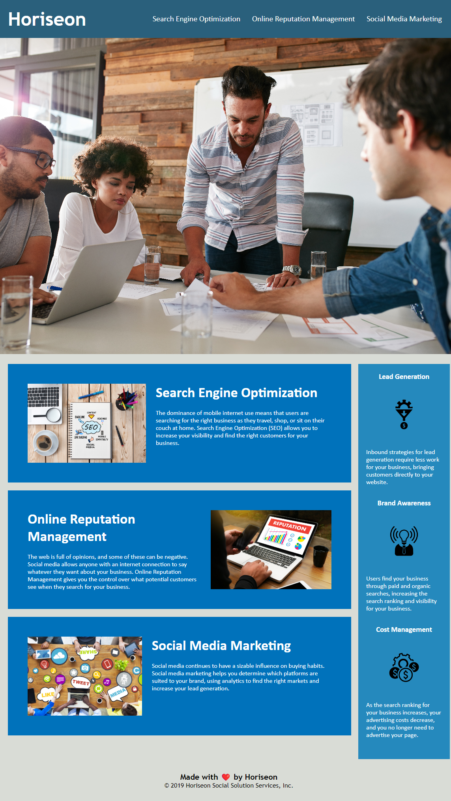

# bootcamp-challenge-01

## Link to Application
https://dan-watkins.github.io/bootcamp-challenge-01/

## Description
This page is a mockup of a profesional marketing site for Horiseon, specializing in SEO optimization.

The site uses semantic HTML and CSS to obtain the look and feel deserving of any professional marketing platforms.

While the main site navigation was mostly intact there were several elements that were refactored, including:

* Updating of non semantic HTML elements to use semantic elements (Header, Footer, Nav, Section, Figure, and Aside).

* Addressing broken CSS components as a result of the HTML refactor.

* Fixed "Search Engine Optimization" navigation anchor tag to properly scroll to the relevant content.

* Adding alt tags to images for accessibility.

## Installation
Simply clone the repository. The current project is deployed using GitHub pages, which you will need to do as well.

* In the Settings for your respoitory scroll down to the 'Code and automation' section and find 'Pages.'

* Branch should be 'main.' Save.

* This step may take a moment to generate the page URL. Be patient.

* Once Page build and deploy is complete you should be able to access the site via <your-github-username.github.io/your-repository-name>.